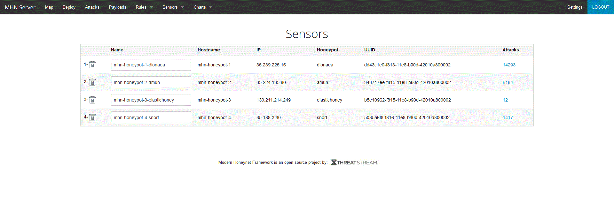

# Project 9 - Honeypot

Time spent: **6** hours spent in total

## Honeypots deployed:
* Dionaea
* Amun
* ElasticHoney
* Snort

## Issues
The only major issue I ran in to was that I could not connect to the admin interface for MHN. I realized I was able to connect to HoneyMap on port 3000, so I added port 80 to the firewall rule and it worked fine. In the future I think it would be good to include this in the instructions for the setup.

Not really an issue, but one thing I did differently is that I used the online gcloud console/ssh. This saves a ton of time since it does not require installing gcloud services on any computers and it connects in a much easier fashion.

## Summary of data

* 21768 total attacks
* Dionaea recieved by far the most attacks with 14915 with the next closest being Amun with 6155 attacks.
* ElasticHoney recieved very few attacks (only 12)
* Top 5 attacked ports:
  * 5972 attacks on port 445 - carries many Windows services which have been known to be vulnerable in the past, so it makes sense to check this port
  * 4841 attacks on port 8088 - this port seems to be a generic HTTP port, potentially used for proxies
  * 1644 attacks on port 23 - Telnet port, makes sense since Telnet access could allow an attacker complete control
  * 894 attacks on port 5060 - generally for VoIP, many known vulnerabilities
  * 592 attacks on port 80 - standard HTTP port, probably looking for simple web exploits

## Unresolved questions
 * What makes each Honeypot different? Why do they get such a wide range of attack numbers? - Presumably each Honeypot has different ports open and they are each sensitive to only certain attacks, but it would be interesting to know the specifics.

[session.json](session.json)
